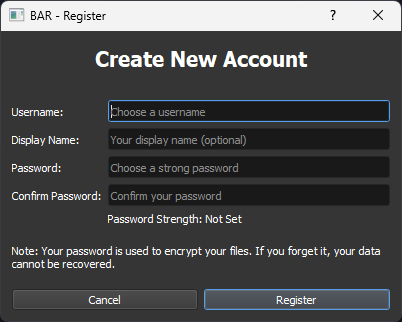
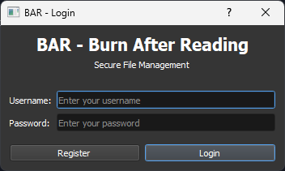
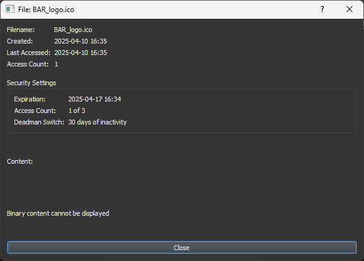

# 🔥 BAR - Burn After Reading 🔥

**A secure, offline file management system with self-destruction capabilities and advanced file scanning**

---

## 📋 Overview

BAR (Burn After Reading) is a standalone desktop application that provides secure file management with advanced security features. It runs entirely offline with no server dependencies, ensuring your sensitive data never leaves your machine. The application includes powerful file scanning capabilities to detect and manage .bar files across your devices.

---

## ✨ Key Features

- **🔒 Completely Offline Operation**: Works without internet connection or server dependencies
- **🛡️ Strong Encryption**: AES-256 encryption for all file content
- **⏱️ Self-Destruction Mechanisms**:
  - Time-based expiration
  - Access count limits
  - Deadman switch (files delete after period of inactivity)
- **🔑 Secure Key Management**: PBKDF2 with high iteration counts
- **📱 Remote Wipe Capability**: File monitoring for triggered deletion
- **👤 User Authentication**: Local user registration and login
- **⚙️ Customizable Security Settings**: Configure security parameters per file
- **🔄 File Sharing**: Export/import encrypted files with proper authentication
- **🔍 Advanced File Scanning**: Detect and validate .bar files across all connected devices
- **💻 Intuitive Interface**: Clean UI showing file security status
- **🎨 Themes and Configuration**: Personalize your experience

---

## 🔐 Security Features

<b>Encryption</b>

- AES-256 in GCM mode for authenticated encryption
- Unique encryption key for each file
- Key derivation using PBKDF2-HMAC-SHA256

<b>Self-Destruction</b>

- Time-based: Files automatically delete after a specified time
- Access-count: Files delete after being accessed a certain number of times
- Deadman switch: Files delete if not accessed within a specified period

<b>Secure Storage</b>

- All data stored locally in the `~/.bar` directory with proper encryption
- No plaintext storage of sensitive information
- Secure key management

<b>File Scanning</b>

- Signature validation to ensure file integrity
- Version compatibility checking
- Secure detection of .bar files across all connected devices
- Support for removable media scanning

---

## 💿 Installation

<b>Option 1: Running the Executable</b>

1. Download the latest release of BAR.exe
2. No installation required - simply double-click the executable to run

<b>Option 2: Running from Source</b>

1. Ensure you have Python 3.8 or higher installed
2. Clone or download the repository
3. Install dependencies: `pip install -r requirements.txt`
4. Run the application: `python main.py`

<b>Option 3: Building Your Own Executable</b>

1. Install dependencies: `pip install -r requirements.txt`
2. Run the build script: `python build.py`
3. Find the executable in the `dist` directory

---

## 📱 Usage

### First-Time Setup
Create a local user account with a strong password
   

### Login
Access your secure file storage
   

### File Operations

<b>Create new secure files with custom security settings</b>

<b>Access existing files (subject to security constraints)</b>

<b>Export files for sharing</b>

<b>Other Operations</b>

- Import shared files
- Scan devices for .bar files

### Configuration
Adjust application settings and themes
   

---

## 🔧 Technical Details

- Built with Python 3.8+ and PyQt5
- Packaged as a standalone Windows executable using PyInstaller
- All data stored locally with proper encryption
- No external dependencies or internet connection required
- File scanning engine supports all Windows drive types (Fixed, Removable, Network, etc.)
- Multi-threaded scanning for improved performance
- Validation of .bar files using signature verification and version compatibility checks

---

## 🚀 Where BAR Can Be Useful

BAR is designed for scenarios where secure, temporary file storage and sharing are critical:

| Scenario | Description |
|----------|-------------|
| **Sensitive Document Sharing** | Securely share confidential documents with colleagues or clients with automatic deletion after viewing |
| **Temporary Credential Storage** | Store passwords, API keys, or access tokens that self-destruct after use |
| **Legal and Compliance** | Meet data retention policies by ensuring files are automatically deleted after required periods |
| **Personal Privacy** | Protect sensitive personal information with files that can't be recovered after deletion |
| **Secure Communication** | Exchange sensitive information with built-in destruction capabilities |
| **Corporate Environments** | Protect intellectual property and trade secrets with controlled access |
| **Healthcare Settings** | Share patient information securely with automatic expiration |
| **Financial Services** | Protect financial documents and statements with time-limited access |

---

## ⚙️ How BAR Works

1. **Secure Storage**: Files are encrypted using AES-256 and stored locally with no cloud dependencies
2. **Self-Destruction Mechanisms**: 
   - Time-based expiration ensures files are automatically deleted after a specified period
   - Access count limits delete files after being viewed a set number of times
   - Deadman switch removes files that haven't been accessed within a defined timeframe
3. **Device Scanning**: The advanced scanning engine can locate and validate .bar files across all connected devices
4. **Secure Sharing**: Export encrypted files that maintain all security constraints when shared
5. **Offline Security**: All security features function without internet connectivity

---

## 📝 Best Practices

- Use strong, unique passwords
- Set appropriate security parameters based on sensitivity
- Regularly back up non-sensitive data
- Remember that destroyed files cannot be recovered
- Scan removable devices before importing files
- Check the logs in `~/.bar/logs` directory if you encounter any issues
- If you forget your password, your data cannot be recovered