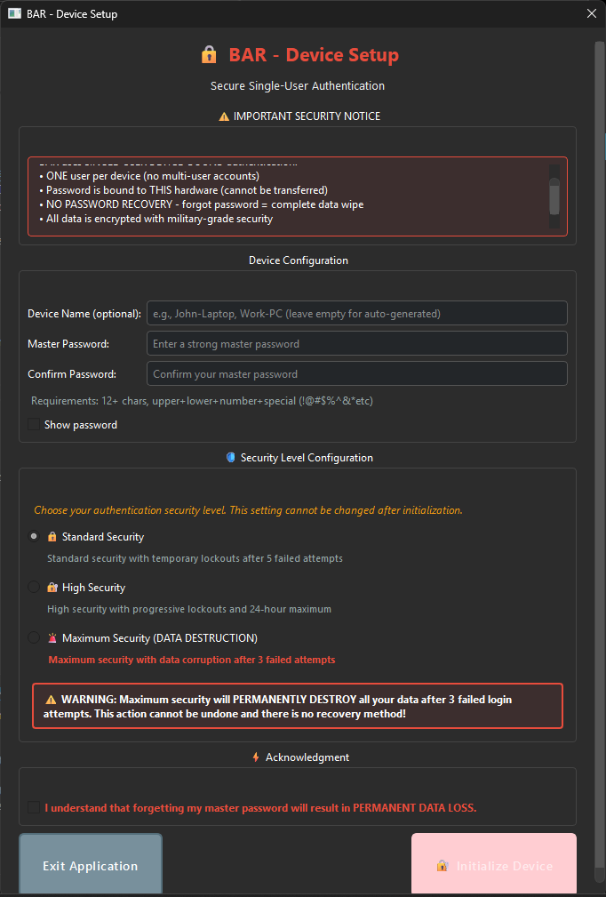

<div align="center">

# 🔥 BAR - Burn After Reading 🔥

**Mission Impossible for your files—they self-destruct, no Tom Cruise required**


[](https://www.gnu.org/licenses/gpl-3.0)
[]()

Version 2.0.0 | Made by [Rolan (RNR)](https://rolan-rnr.netlify.app/)

</div>

---

## 🤔 What's This Thing Do?

You know how in spy movies they read a secret message and it bursts into flames? Yeah, BAR does that but for your computer files (minus the actual flames, sorry).

**In plain English:**
- 📁 Store files with built-in self-destruct timers
- 🔐 Everything encrypted with military-grade security  
- 💻 Works 100% offline—your files never leave your computer
- 🔥 Files can vanish after X views, X days, or when you hit the panic button
- 🚫 No cloud, no servers, no one snooping on your data

<div align="center">

</div>

### ⚠️ Important: This Thing Actually Deletes Your Files!

Okay, real talk for a second:

When BAR deletes something, it's **GONE**. Like, CIA-level gone. No recovery software, no "Oops" button, nada. If you tell it to delete something, it WILL delete it. Forever.

**Before you use this:**
- ✅ Read the [DISCLAIMER.md](DISCLAIMER.md) (yes, it's actually important)
- ✅ Make sure encryption software is legal where you live
- ✅ Use strong passwords ("password123" is not strong)
- ✅ Backup anything you might regret losing

---

## 🎉 Cool Features

### Self-Destruct Options (The Fun Stuff)
- **⏱️ Time Bombs**: "Delete this file in 24 hours" — Snapchat vibes for any file
- **🔢 View Limits**: "Self-destruct after 3 views" — Secret agent style
- **⚰️ Deadman Switch**: Don't log in for a week? Files auto-delete (spooky but useful)
- **🚨 Panic Button**: "Someone's coming! NUKE EVERYTHING!" — Works in seconds
- **🔨 Anti-Brute Force**: Too many wrong passwords = file self-destructs

### Security Features (The Boring-But-Important Stuff)
- **🔒 AES-256 Encryption**: Same tech the CIA uses (probably)
- **📸 Screenshot Blocker**: Tries to stop screenshots (spoiler: phone cameras still work)
- **💻 100% Offline**: No internet, no cloud, no data leaving your PC
- **🔑 Hardware Binding**: Lock files to your specific computer
- **🗑️ Secure Wipe**: Overwrites files multiple times (forensics teams hate this one trick)

### User Experience
- 🎯 **One password** per device (no complex account stuff)
- 🎨 **Dark theme** by default (your retinas will thank me)
- ⚡ **Fast scanning** for .bar files across all your drives
- 👁️ **View-only mode** for showing files without sharing

---

## 🧐 For the Tech Nerds

<details>
<summary><b>Click if you care about the technical details</b></summary>

**Encryption:**
- AES-256-GCM (military-grade, authenticated encryption)
- PBKDF2-HMAC-SHA256 for key derivation
- Unique key per file
- Hardware-binding option

**Panic Wipe Levels:**
- **Selective**: Just clears session data
- **Aggressive**: Nukes all BAR data (98%+ gone)
- **Scorched Earth**: Maximum destruction + anti-forensics

**Screenshot Protection:**
- Blocks Print Screen, Win+Shift+S, Snipping Tool
- Clipboard monitoring
- Process detection and termination
- Multi-layer defense (but phone cameras still work, sorry)

**Storage:**
- Everything in `~/.bar` directory
- Secure deletion with multiple overwrites
- Blacklist prevents reimporting deleted files

</details>

---

## 🚀 Quick Start

**What you need:**
- Windows 10/11 (works best) or Linux/macOS (limited features)
- 4GB RAM minimum
- ~100MB disk space
- No internet required!

**Installation:**

<details>
<summary><b>📦 Option 1: Download EXE (Easiest)</b></summary>

1. Download `BAR.exe` from releases
2. Double-click it
3. Create your master password
4. Done! 🎉

</details>

<details>
<summary><b>👨‍💻 Option 2: Run from Source</b></summary>

```bash
git clone [repo-url]
cd BAR
pip install -r requirements.txt
python main.py
```

</details>

<details>
<summary><b>🔨 Option 3: Build It Yourself</b></summary>

```bash
pip install -r requirements.txt
python build.py
# Your exe is in the dist/ folder
```

</details>

---

## 👋 How to Use

**First time setup:**
1. Open BAR
2. Create master password
3. Pick security level (Standard/High/Maximum)
4. Done!

<details>
<summary>Screenshots</summary>

[](resources/First_time_Login_interface.png)
[](resources/app_interface.png)

</details>

**Daily use:**
- Unlock with your password
- Add files with "Add File" button
- Set self-destruct options (time, views, etc.)
- That's it!

---

## 🤔 When Should You Use This?

- 💼 Sharing confidential work docs
- 🔑 Temporary password/API key storage
- 💰 Financial documents you don't want hanging around
- 🏥 Healthcare records with auto-expiration
- 📝 Any sensitive file that shouldn't exist forever

---

## ⚠️ Important Tips

**🔐 Security Levels:**
- **Standard**: 5 wrong passwords = temporary lockout
- **High**: 4 wrong passwords = longer lockouts (up to 24hrs)
- **Maximum**: 3 wrong passwords = **EVERYTHING DELETED** ☠️

**💀 Things That Will Bite You:**
- ❌ **NO PASSWORD RECOVERY** — Forget it = lose everything
- 💾 Deadman switch will auto-delete if you don't log in
- 🔥 Panic wipe = fresh install (all data gone)
- 📋 Backup non-secret stuff elsewhere

**✅ Pro Tips:**
- Use strong passwords (not "password123")
- Don't use Maximum security on your grocery list
- Check logs at `~/.bar/logs` if something breaks

---

## ⚖️ Legal Stuff

🚨 **Read this or risk getting in trouble:**
- Check if encryption software is legal in your country
- Don't delete files you're legally required to keep (GDPR, HIPAA, etc.)
- Use for legal purposes only (duh)
- Software provided "as-is" — I'm not liable if something breaks

📜 **Full details:** [DISCLAIMER.md](DISCLAIMER.md)

**License:** GPL-3.0  
Free, open-source, modify as you want. Just keep it open-source if you share it.

---

## 👋 About

Built by **[Rolan (RNR)](https://rolan-rnr.netlify.app/)** because good self-destructing file tools didn't exist.

Goal: Military-grade security that doesn't require a PhD to use.

Questions? Feedback? Feel free to reach out!

---

<div align="center">

### 🔥 BAR - Because Some Things Should Just... Disappear 🔥

*Your files will self-destruct. Your privacy won't.*

</div>
