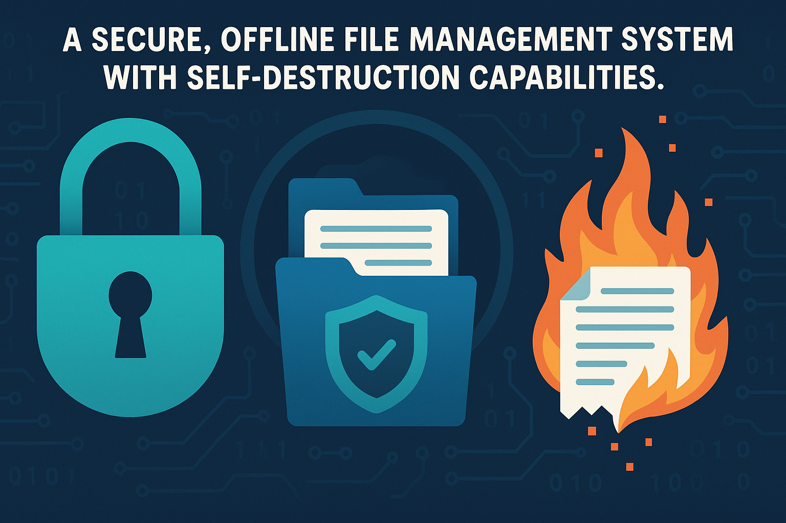
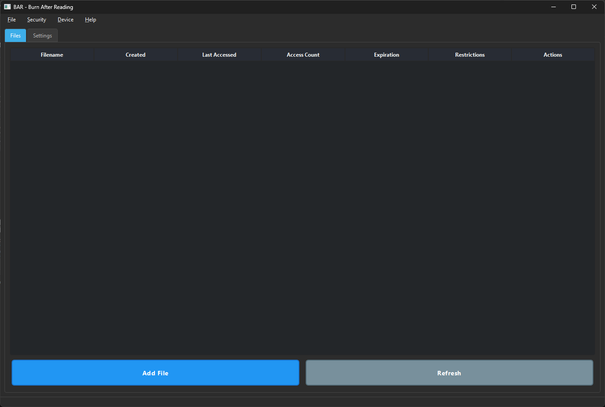
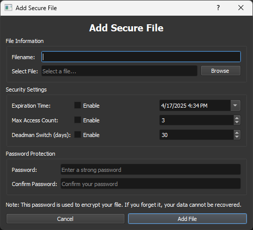
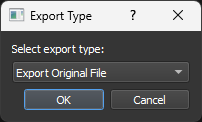
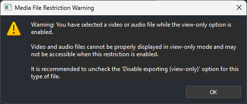
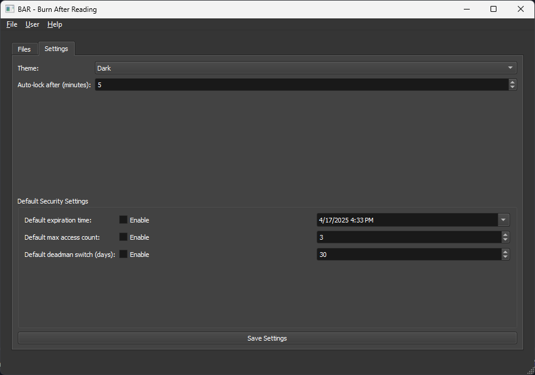

# 🔥 BAR - Burn After Reading 🔥

**A secure, offline file management system with self-destruction capabilities and advanced security features**

> **IMPORTANT**: Before using BAR, please read the [DISCLAIMER.md](DISCLAIMER.md) file for important legal and security information.

---

## 📋 Overview

BAR (Burn After Reading) is a powerful desktop application designed for secure file management with advanced security features including self-destruction capabilities. Operating entirely offline with no server dependencies, BAR ensures your sensitive data never leaves your machine.

The application combines strong encryption, customizable security settings, and comprehensive file scanning to provide a complete solution for protecting your most sensitive information.

### ⚠️ Important Security Notice

BAR includes powerful security features that can result in **permanent data loss**. By using this application, you acknowledge that:

- Files deleted through BAR's security features **CANNOT be recovered**
- You are responsible for ensuring your use complies with local laws and regulations
- The security of your data depends on the strength of your passwords
- No security measure is 100% foolproof

See the [full disclaimer](DISCLAIMER.md) for complete details on legal considerations and proper usage.

---

## ✨ Key Features

### Core Security
- **🔒 Completely Offline Operation**: Works without internet connection or server dependencies
- **🛡️ Military-Grade Encryption**: AES-256 in GCM mode for authenticated encryption
- **🔑 Secure Key Management**: PBKDF2 with high iteration counts and hardware binding options
- **📸 Advanced Screenshot Protection**: Real-time blocking of screenshot attempts with multi-layer detection

### Self-Destruction Mechanisms
- **⏱️ Time-based Expiration**: Files automatically delete after a specified time
- **🔢 Access Count Limits**: Files delete after being accessed a certain number of times
- **⚰️ Deadman Switch**: Files delete after a period of inactivity
- **🔨 Anti-Brute Force**: Files delete after multiple failed password attempts
- **🚨 Panic Wipe System**: Complete application reset with 98%+ data destruction rate
- **🔥 Emergency Protocol**: Three-tier destruction levels (Selective/Aggressive/Scorched Earth)

### File Management
- **📱 Advanced File Scanning**: Detect and validate .bar files across all connected devices
- **🔍 Multi-threaded Scanning**: Fast scanning of all storage devices including removable media
- **🔄 Secure File Sharing**: Export/import encrypted files with security constraints intact
- **🗑️ Secure Deletion**: Multi-pass overwrite techniques to prevent data recovery
- **👁️ View-Only Protection**: Enhanced security for view-only files with comprehensive anti-capture measures

### User Experience
- **🔐 Device Authentication**: Single-user device-bound authentication with hardware binding
- **💻 Intuitive Interface**: Clean UI showing file security status and expiration details
- **🎨 Dark Theme**: Professional dark theme optimized for security applications
- **⚡ Fast Operation**: Streamlined authentication flow with direct access after device unlock

---

## 🔐 Security Architecture

<b>Encryption System</b>

- AES-256 in GCM mode for authenticated encryption
- Unique encryption key for each file
- Key derivation using PBKDF2-HMAC-SHA256 with high iteration counts
- Hardware-binding option to prevent access from unauthorized devices
- Secure memory handling to prevent key exposure

<b>Self-Destruction Mechanisms</b>

- **File-Level Security**: Time-based, access-count, deadman switch, and anti-brute force protection
- **Application-Level Security**: Complete panic wipe system with three destruction tiers
  - *Selective*: Session data only (preserves user files)
  - *Aggressive*: Complete BAR removal (98%+ destruction rate)
  - *Scorched Earth*: Maximum destruction with anti-forensic countermeasures
- **Advanced Features**: 
  - Hardware entropy injection and registry cleanup (Windows)
  - Multiple-pass overwrite with DoD-standard patterns
  - Complete application reset (starts as fresh installation)
  - Anti-forensic decoy files and trace elimination
- **Background Monitoring**: Real-time enforcement of security constraints

<b>Secure Storage</b>

- All data stored locally in the `~/.bar` directory with proper encryption
- No plaintext storage of sensitive information
- Secure key management with memory protection
- Blacklist system to prevent reimporting of deleted sensitive files
- File integrity verification using digital signatures

<b>Anti-Tampering Protection</b>

- Runtime integrity checks to detect application tampering
- Hardware ID verification to prevent unauthorized device access
- Secure random number generation for cryptographic operations
- Protection against timing attacks in cryptographic implementations
- Memory protection to prevent sensitive data exposure

<b>Screenshot Protection System</b>

- **Real-time Keyboard Hook Blocking**: Intercepts Print Screen, Win+Shift+S, Alt+Print Screen
- **Clipboard Monitoring**: Detects and clears screenshot images from clipboard immediately
- **Process Detection**: Monitors and terminates screenshot applications (Snipping Tool, third-party tools)
- **Focus Change Tracking**: Monitors window focus changes and suspicious behavior
- **Statistical Analysis**: Tracks and scores suspicious activities for breach detection
- **Multi-layer Defense**: Combines multiple protection methods for comprehensive coverage
- **Real-time Event Logging**: Comprehensive logging of all security events and attempts

---

## 💿 Installation

### System Requirements
- **Operating System**: Windows 10/11 (primary support), limited support for Linux/macOS
- **RAM**: 4GB minimum, 8GB recommended
- **Storage**: 100MB for application, additional space for secure files
- **No internet connection required** for operation

### Installation Options

<b>Option 1: Running the Executable (Recommended)</b>

1. Download the latest release of BAR.exe from the releases page
2. No installation required - simply double-click the executable to run
3. On first run, you'll need to initialize the device with a strong master password
4. The application will automatically create the necessary directories and configuration files

<b>Option 2: Running from Source</b>

1. Ensure you have Python 3.8 or higher installed
2. Clone or download the repository
3. Install dependencies: `pip install -r requirements.txt`
   - Required dependencies include PySide6 (v6.9.0), cryptography (v41.0.3)
4. Run the application: `python main.py`
5. For development purposes, you can use the `--debug` flag: `python main.py --debug`

<b>Option 3: Building Your Own Executable</b>

1. Install dependencies: `pip install -r requirements.txt`
   - Includes PyInstaller (v6.0.0) for building the executable
2. Run the build script: `python build.py`
3. Find the executable in the `dist` directory
4. For a smaller executable size, use the `--onefile` option: `python build.py --onefile`

---

## 📱 Usage Guide

### First-Time Setup
Initialize your device with a strong master password (hardware-bound)

- **Responsive Setup Dialog**: Automatically fits all screen sizes with improved layout
- **Security Level Selection**: Choose from Standard, High, or Maximum security levels
- **Hardware Binding**: Device-bound authentication prevents unauthorized access
- **Complete Security**: Three-tier security configuration with data destruction options
   
*Note: v2.0.0 uses single-user device authentication - no separate user accounts needed*

### Device Authentication
Unlock your secure file storage with your master password

*Note: Device unlock is the only authentication step - no separate login required*

### Main Interface
Manage your secure files and access application features

### File Operations

<b>Creating Secure Files</b>

1. Click the "Add File" button in the main interface
2. Select the file you want to secure
3. Configure security settings:
   - Set expiration time (if desired)
   - Set maximum access count (if desired)
   - Configure deadman switch (if desired)
   - Set password protection level
   - Enable/disable hardware binding
4. Click "Create Secure File" to complete the process

<b>Accessing Secure Files</b>

1. Select the file from the main interface
2. Enter the password when prompted
3. View file details and content (subject to security constraints)
4. Note that accessing the file may count toward access limits if configured

<b>Exporting and Sharing Files</b>

1. Select the file you want to export
2. Choose export format:
   - Original file: Exports the decrypted original file (requires password)
   - Portable encrypted file: Exports the .bar file with all security constraints intact
3. Select destination location
4. Share the exported file securely

<b>Scanning for .bar Files</b>

1. Click the "Scan" button in the main interface
2. Select which drives to scan (fixed, removable, network)
3. Wait for the scan to complete
4. Review found .bar files and import if desired
5. The scanner validates file integrity and version compatibility

<b>Enhanced View-Only File Protection</b>

BAR includes comprehensive protection for view-only files to prevent unauthorized capture:

**Advanced Screenshot Protection:**
- Real-time blocking of screenshot hotkeys (Print Screen, Win+Shift+S, Alt+Print Screen)
- Automatic detection and clearing of screenshot images from clipboard
- Process monitoring to detect and terminate screenshot applications
- Focus change monitoring to track suspicious window switching behavior
- Statistical analysis of security events with automatic breach response

**Multi-layer Security:**
- Keyboard hook interception at the Windows system level
- Clipboard monitoring with image detection capabilities
- Process whitelist/blacklist system for development environments
- Dynamic watermarking and security overlays
- Comprehensive security event logging and scoring

**Limitations:**
- Mobile phone cameras cannot be blocked (hardware limitation)
- External screen capture devices are not detectable
- Administrative/elevated screenshot tools may bypass some protections

### Application Settings
Configure application behavior, security parameters, and appearance
   

---

## 🚀 Use Cases

BAR is designed for scenarios where secure, temporary file storage and sharing are critical:

| Scenario | Description |
|----------|-------------|
| **Sensitive Document Sharing** | Securely share confidential documents with colleagues or clients with automatic deletion after viewing |
| **Temporary Credential Storage** | Store passwords, API keys, or access tokens that self-destruct after use |
| **Legal and Compliance** | Meet data retention policies by ensuring files are automatically deleted after required periods |
| **Personal Privacy** | Protect sensitive personal information with files that can't be recovered after deletion |
| **Secure Communication** | Exchange sensitive information with built-in destruction capabilities |
| **Corporate Environments** | Protect intellectual property and trade secrets with controlled access |
| **Healthcare Settings** | Share patient information securely with automatic expiration |
| **Financial Services** | Protect financial documents and statements with time-limited access |

---

## 📝 Best Practices

- **Password Security**: Use strong, unique passwords with a mix of character types
- **Security Parameters**: Set appropriate security constraints based on data sensitivity
- **Backup Strategy**: Regularly back up non-sensitive data (remember that securely deleted files CANNOT be recovered)
- **Deadman Switch**: Be cautious with this feature - files will be permanently deleted if not accessed within the specified period
- **Device Scanning**: Scan removable devices before importing files to ensure integrity
- **Logging**: Check the logs in `~/.bar/logs` directory for troubleshooting
- **Hardware Binding**: Enable for critical files to prevent unauthorized access from different devices
- **Security Levels**: Choose appropriate security level based on threat model:
  - *Standard*: 5 failed attempts → temporary lockout
  - *High*: 4 failed attempts → progressive lockouts (up to 24 hours)
  - *Maximum*: 3 failed attempts → **PERMANENT DATA DESTRUCTION**
- **Panic Wipe**: Emergency destruction available through UI or hotkeys
- **Password Recovery**: **CRITICAL** - No password recovery exists. Forgotten password = complete data loss
- **Complete Reset**: Panic wipe removes ALL traces, application starts fresh after system restart

---

## 📜 Legal Considerations

BAR is designed for legitimate security purposes. Please be aware of the following important legal considerations:

- **Encryption Regulations**: The use of encryption software may be regulated or restricted in certain countries or jurisdictions. It is your responsibility to ensure your use of BAR complies with all applicable laws.

- **Data Protection Laws**: When using BAR to store or process data subject to data protection regulations (such as GDPR, CCPA, HIPAA, etc.), ensure your usage complies with all relevant requirements.

- **Legitimate Use**: BAR should only be used for lawful purposes. Do not use this application to circumvent legal data retention requirements or for any illegal activities.

- **No Warranty**: BAR is provided "AS IS" without warranty of any kind. The developers are not liable for any damages or data loss resulting from the use of this application.

For complete legal information, please refer to the [DISCLAIMER.md](DISCLAIMER.md) file included with this application.

---

## 📄 License

BAR is licensed under the GNU General Public License v3.0 (GPL-3.0).

- **Free Software**: You are free to use, modify, and distribute this software.
- **Copyleft**: Any derivative works must also be distributed under the same license terms.
- **Source Code**: If you distribute this software, you must make the source code available.
- **No Warranty**: This software is provided without warranty of any kind.

For the full license text, see the [LICENSE](LICENSE) file included with this application or visit the [GNU GPL v3.0 website](https://www.gnu.org/licenses/gpl-3.0.en.html).

---

## 👨‍💻 About the Author

BAR was created by **Rolan (RNR)**, a passionate cybersecurity enthusiast and software developer dedicated to creating tools that enhance digital privacy and security. With extensive experience in security architecture and anti-forensics techniques, Rolan has designed BAR to provide military-grade protection for sensitive data while maintaining ease of use.

---

**BAR - Because some things are meant to be temporary.**

