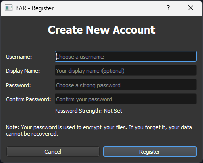
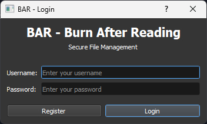
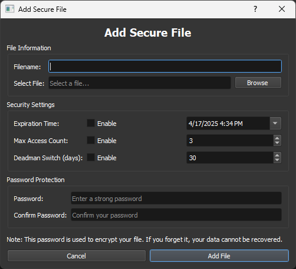
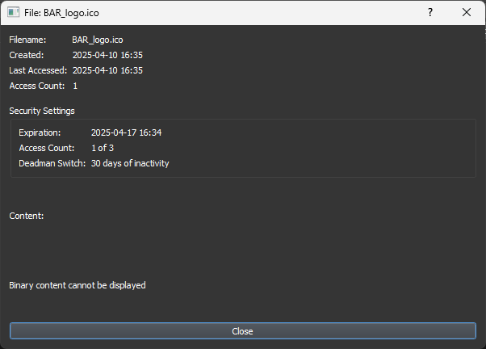
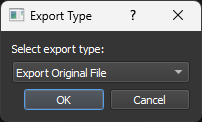
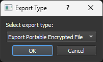
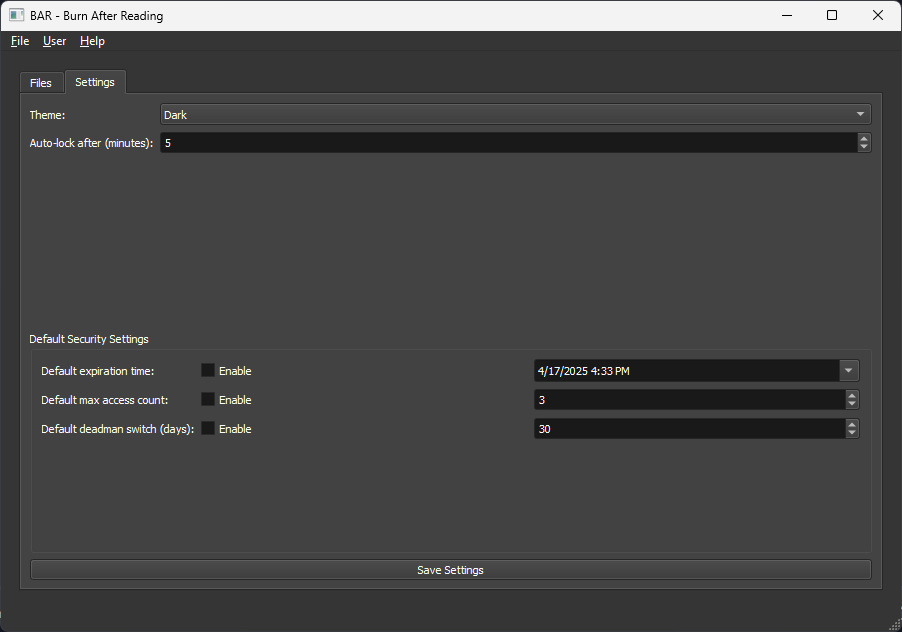

# 🔥 BAR - Burn After Reading 🔥

**A secure, offline file management system with self-destruction capabilities and advanced file scanning**

---

## 📋 Overview

BAR (Burn After Reading) is a standalone desktop application that provides secure file management with advanced security features. It runs entirely offline with no server dependencies, ensuring your sensitive data never leaves your machine. The application includes powerful file scanning capabilities to detect and manage .bar files across your devices, with robust security measures to protect against unauthorized access attempts.

---

## ✨ Key Features

- **🔒 Completely Offline Operation**: Works without internet connection or server dependencies
- **🛡️ Strong Encryption**: AES-256 encryption for all file content
- **⏱️ Self-Destruction Mechanisms**:
  - Time-based expiration
  - Access count limits
  - Deadman switch (files delete after period of inactivity)
- **🔑 Secure Key Management**: PBKDF2 with high iteration counts
- **📱 Remote Wipe Capability**: File monitoring for triggered deletion
- **👤 User Authentication**: Local user registration and login
- **⚙️ Customizable Security Settings**: Configure security parameters per file
- **🔄 File Sharing**: Export/import encrypted files with proper authentication
- **🔍 Advanced File Scanning**: Detect and validate .bar files across all connected devices
- **💻 Intuitive Interface**: Clean UI showing file security status
- **🎨 Themes and Configuration**: Personalize your experience

---

## 🔐 Security Features

<b>Encryption</b>

- AES-256 in GCM mode for authenticated encryption
- Unique encryption key for each file
- Key derivation using PBKDF2-HMAC-SHA256
- Hardware-binding option for enhanced security

<b>Self-Destruction</b>

- Time-based: Files automatically delete after a specified time
- Access-count: Files delete after being accessed a certain number of times
- Deadman switch: Files delete if not accessed within a specified period
- Secure deletion using multi-pass overwrite techniques

<b>Secure Storage</b>

- All data stored locally in the `~/.bar` directory with proper encryption
- No plaintext storage of sensitive information
- Secure key management
- Blacklist system to prevent reimporting of deleted sensitive files

<b>Anti-Brute Force Protection</b>

- Automatic file deletion after multiple failed password attempts
- Account lockout after excessive login failures
- Failed attempt tracking and logging
- Blacklisting of compromised file signatures

<b>File Scanning</b>

- Signature validation to ensure file integrity
- Version compatibility checking
- Secure detection of .bar files across all connected devices
- Support for removable media scanning
- Multi-threaded scanning for improved performance

---

## 💿 Installation

<b>Option 1: Running the Executable</b>

1. Download the latest release of BAR.exe from the releases page
2. No installation required - simply double-click the executable to run
3. On first run, you'll need to create a user account with a strong password

<b>Option 2: Running from Source</b>

1. Ensure you have Python 3.8 or higher installed
2. Clone or download the repository
3. Install dependencies: `pip install -r requirements.txt`
   - Required dependencies include PyQt5 (v5.15.9), cryptography (v41.0.3)
4. Run the application: `python main.py`

<b>Option 3: Building Your Own Executable</b>

1. Install dependencies: `pip install -r requirements.txt`
   - Includes PyInstaller (v6.0.0) for building the executable
2. Run the build script: `python build.py`
3. Find the executable in the `dist` directory

<b>System Requirements</b>

- Operating System: Windows 10/11 (primary support), limited support for Linux/macOS
- RAM: 4GB minimum, 8GB recommended
- Storage: 100MB for application, additional space for secure files
- No internet connection required for operation

---

## 📱 Usage

### First-Time Setup
Create a local user account with a strong password
   

### Login
Access your secure file storage
   

### File Operations

<b>Create new secure files with custom security settings</b>

<b>Access existing files (subject to security constraints)</b>

<b>Export files for sharing</b>

<b>Other Operations</b>

- Import shared files
- Scan devices for .bar files

### Configuration
Adjust application settings and themes
   

---

## 🔧 Technical Details

- Built with Python 3.8+ and PyQt5 for cross-platform compatibility
- Packaged as a standalone Windows executable using PyInstaller
- All data stored locally with proper encryption
- No external dependencies or internet connection required
- File scanning engine supports all Windows drive types (Fixed, Removable, Network, etc.)
- Multi-threaded scanning for improved performance
- Validation of .bar files using signature verification and version compatibility checks
- Secure deletion using industry-standard techniques to prevent data recovery
- Blacklist system to prevent reimporting of deleted sensitive files
- Comprehensive logging system for security auditing and troubleshooting

---

## 🚀 Where BAR Can Be Useful

BAR is designed for scenarios where secure, temporary file storage and sharing are critical:

| Scenario | Description |
|----------|-------------|
| **Sensitive Document Sharing** | Securely share confidential documents with colleagues or clients with automatic deletion after viewing |
| **Temporary Credential Storage** | Store passwords, API keys, or access tokens that self-destruct after use |
| **Legal and Compliance** | Meet data retention policies by ensuring files are automatically deleted after required periods |
| **Personal Privacy** | Protect sensitive personal information with files that can't be recovered after deletion |
| **Secure Communication** | Exchange sensitive information with built-in destruction capabilities |
| **Corporate Environments** | Protect intellectual property and trade secrets with controlled access |
| **Healthcare Settings** | Share patient information securely with automatic expiration |
| **Financial Services** | Protect financial documents and statements with time-limited access |

---

## ⚙️ How BAR Works

1. **Secure Storage**: Files are encrypted using AES-256 and stored locally with no cloud dependencies
2. **Self-Destruction Mechanisms**: 
   - Time-based expiration ensures files are automatically deleted after a specified period
   - Access count limits delete files after being viewed a set number of times
   - Deadman switch removes files that haven't been accessed within a defined timeframe
   - Anti-brute force protection permanently deletes files after multiple failed password attempts
3. **Device Scanning**: The advanced scanning engine can locate and validate .bar files across all connected devices
4. **Secure Sharing**: Export encrypted files that maintain all security constraints when shared
5. **Offline Security**: All security features function without internet connectivity
6. **Blacklist Protection**: Files that have been securely deleted are added to a blacklist to prevent reimporting
7. **Continuous Monitoring**: Background threads constantly check for security condition violations

---

## 📝 Best Practices

- Use strong, unique passwords with a mix of uppercase, lowercase, numbers, and special characters
- Set appropriate security parameters based on sensitivity level of your data
- Regularly back up non-sensitive data (remember that securely deleted files CANNOT be recovered)
- Be cautious with the deadman switch feature - files will be permanently deleted if not accessed within the specified period
- Scan removable devices before importing files to ensure integrity
- Check the logs in `~/.bar/logs` directory if you encounter any issues
- Consider enabling hardware binding for critical files to prevent unauthorized access from different devices
- Remember that after 3 failed password attempts, files will be permanently deleted as an anti-brute force measure
- If you forget your password, your data cannot be recovered

---

## 👨‍💻 About the Author

BAR was created by me (**Rolan Lobo**), a passionate cybersecurity enthusiast and software developer dedicated to creating tools that enhance digital privacy and security.

### Why I Created BAR

I developed BAR to address the growing need for secure, offline file management solutions that put users in complete control of their sensitive data. In today's interconnected world, I believe everyone deserves access to powerful security tools that don't require technical expertise to use effectively.

### My Vision

My goal with BAR is to make advanced security features accessible to everyone while maintaining the highest standards of privacy and data protection. I'm committed to continuing development on this project to expand its capabilities and keep it at the cutting edge of secure file management.

I welcome feedback, suggestions, and contributions from the community to help make BAR even better!