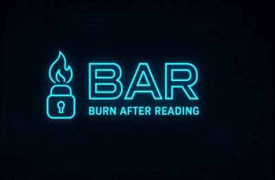
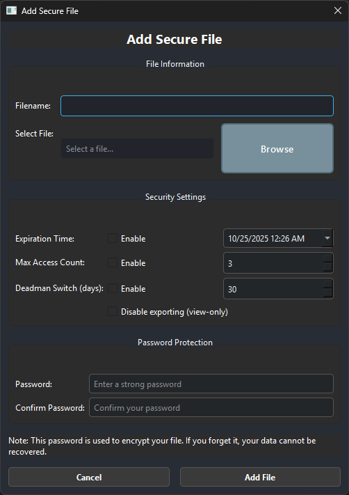
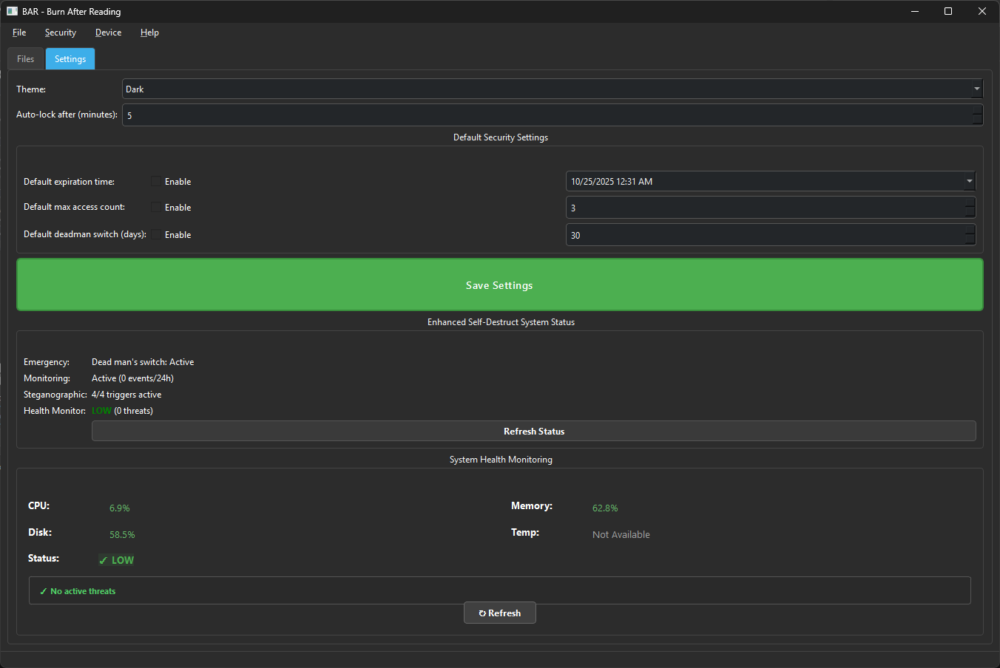

# 🔥 BAR - Burn After Reading 🔥

**Your personal vault for files that are meant to disappear**

> **Hey, quick heads up!** Before diving in, take a moment to read the [DISCLAIMER.md](DISCLAIMER.md) file. It's got some important stuff about security and legal considerations you should know about.

---

## 📋 What's This All About?

Ever wished you could share a file with someone and have it automatically self-destruct after they read it? Like something out of a spy movie? Well, that's exactly what BAR does!

BAR (Burn After Reading) is a desktop app that lets you store and share files with built-in self-destruction capabilities. Think of it as a digital secret agent for your sensitive documents. The best part? Everything happens completely offline on your own machine—no cloud, no servers, no data leaving your computer.

Whether you need files to vanish after being opened once, expire after a certain time, or even trigger a panic wipe in emergencies, BAR's got you covered with military-grade encryption and some pretty cool security features.

### ⚠️ Real Talk: This App Can Permanently Delete Your Stuff

Look, I need to be super clear about something: BAR is designed to make files disappear—like, really disappear. Once they're gone, they're gone forever. No "undo" button, no recovery software will save you.

Here's what you need to understand:

- When BAR deletes something, it's **PERMANENT**. We're talking gone-from-existence permanent.
- You're responsible for making sure you're using this legally in your country (some places have rules about encryption software).
- Your security is only as good as your passwords—so make them strong!
- Nothing in cybersecurity is bulletproof, and that includes BAR.

Seriously, check out the [full disclaimer](DISCLAIMER.md) before you start using this. It's not just legal mumbo-jumbo—it's important stuff.

---

## ✨ What Makes BAR Cool?

### The Security Stuff (Don't Worry, It's Not Boring)
- **🔒 Works Completely Offline**: No internet needed, no data sent anywhere. Your files stay on YOUR machine.
- **🛡️ Military-Grade Encryption**: We use AES-256 encryption—the same stuff governments use to protect classified info.
- **🔑 Smart Key Management**: Your encryption keys are generated using industry-standard methods and can be tied to your specific device.
- **📸 Screenshot Blocker**: Tries to stop people from taking screenshots of your sensitive files (though phone cameras are still a thing, obviously).

### The Self-Destruct Features (The Fun Part!)
- **⏱️ Time Bombs**: Set files to automatically delete after a certain amount of time—like Snapchat, but for any file type.
- **🔢 Read Limits**: Files can self-destruct after being opened a specific number of times. One-time secrets? You got it.
- **⚰️ Deadman Switch**: If you don't check in for a while, your files assume something's wrong and delete themselves.
- **🔨 Brute Force Protection**: Someone trying to guess your password? After too many failed attempts, the file destroys itself.
- **🚨 Panic Button**: Oh no, someone's at the door! Hit the panic button and BAR can wipe everything in seconds.
- **🔥 Choose Your Destruction Level**: From "just clear my session" to "burn everything to the ground," you pick how nuclear you want to go.

### Managing Your Files
- **📱 Smart Scanner**: BAR can scan all your drives (including USB sticks) to find your encrypted .bar files.
- **🔍 Lightning Fast**: Multi-threaded scanning means you're not waiting around forever.
- **🔄 Easy Sharing**: Export encrypted files to share with others—all the security settings stay intact.
- **🗑️ Actually Secure Deletion**: When we delete something, we overwrite it multiple times so forensic tools can't recover it.
- **👁️ View-Only Mode**: Show someone a file without letting them copy, save, or screenshot it (well, we try our best).

### The Experience
- **🔐 One Device, One Password**: Simple device-based authentication—no complicated account systems.
- **💻 Clean Interface**: We made it look good and easy to use. No endless menus or confusing buttons.
- **🎨 Easy on the Eyes**: Dark theme by default because we're not monsters.
- **⚡ No Hassle**: Unlock once and you're in. No repeated logins or annoying prompts.

---

## 🔐 The Nerdy Security Stuff (For Those Who Care)

Okay, if you're still reading, you probably want to know HOW all this security magic works. Here's the technical breakdown:

<b>Encryption System</b>

- AES-256 in GCM mode for authenticated encryption
- Unique encryption key for each file
- Key derivation using PBKDF2-HMAC-SHA256 with high iteration counts
- Hardware-binding option to prevent access from unauthorized devices
- Secure memory handling to prevent key exposure

<b>Self-Destruction Mechanisms</b>

- **File-Level Security**: Time-based, access-count, deadman switch, and anti-brute force protection
- **Application-Level Security**: Complete panic wipe system with three destruction tiers
  - *Selective*: Session data only (preserves user files)
  - *Aggressive*: Complete BAR removal (98%+ destruction rate)
  - *Scorched Earth*: Maximum destruction with anti-forensic countermeasures
- **Advanced Features**: 
  - Hardware entropy injection and registry cleanup (Windows)
  - Multiple-pass overwrite with DoD-standard patterns
  - Complete application reset (starts as fresh installation)
  - Anti-forensic decoy files and trace elimination
- **Background Monitoring**: Real-time enforcement of security constraints

<b>Secure Storage</b>

- All data stored locally in the `~/.bar` directory with proper encryption
- No plaintext storage of sensitive information
- Secure key management with memory protection
- Blacklist system to prevent reimporting of deleted sensitive files
- File integrity verification using digital signatures

<b>Anti-Tampering Protection</b>

- Runtime integrity checks to detect application tampering
- Hardware ID verification to prevent unauthorized device access
- Secure random number generation for cryptographic operations
- Protection against timing attacks in cryptographic implementations
- Memory protection to prevent sensitive data exposure

<b>Screenshot Protection System</b>

- **Real-time Keyboard Hook Blocking**: Intercepts Print Screen, Win+Shift+S, Alt+Print Screen
- **Clipboard Monitoring**: Detects and clears screenshot images from clipboard immediately
- **Process Detection**: Monitors and terminates screenshot applications (Snipping Tool, third-party tools)
- **Focus Change Tracking**: Monitors window focus changes and suspicious behavior
- **Statistical Analysis**: Tracks and scores suspicious activities for breach detection
- **Multi-layer Defense**: Combines multiple protection methods for comprehensive coverage
- **Real-time Event Logging**: Comprehensive logging of all security events and attempts

---

## 💿 Getting Started

### What You'll Need
- **Computer**: Windows 10 or 11 works best. Linux and macOS work too, but with some limitations.
- **RAM**: At least 4GB, though 8GB is better if you've got it.
- **Storage**: About 100MB for BAR itself, plus whatever space your files need.
- **Internet**: Literally don't need it. BAR works 100% offline once you've got it.

### How to Install (Pick Your Flavor)

<b>Option 1: Just Download and Run (Easiest Way)</b>

1. Grab the latest BAR.exe from the releases page
2. That's it! No installer, no setup wizard—just double-click and go
3. First time you run it, you'll create your master password (make it a good one!)
4. BAR will set up all the folders and files it needs automatically

*This is the easiest option for most people. Just download, run, and you're good to go.*

<b>Option 2: Run from Source Code (For Developers)</b>

1. Make sure you've got Python 3.8 or newer installed
2. Clone this repo or download the source code
3. Install the required packages: `pip install -r requirements.txt`
   - You'll get PySide6, cryptography libraries, and everything else you need
4. Fire it up: `python main.py`
5. Want to see what's happening under the hood? Run it in debug mode: `python main.py --debug`

*This option is great if you want to poke around the code or contribute to the project.*

<b>Option 3: Build Your Own Executable (Trust Issues? Respect.)</b>

1. Install the dependencies: `pip install -r requirements.txt`
   - This includes PyInstaller which turns Python code into an .exe file
2. Run the build script: `python build.py`
3. Your shiny new BAR.exe will be in the `dist` folder
4. Want a single-file version? Use: `python build.py --onefile`

*If you don't trust pre-built executables (and honestly, that's a smart security posture), build it yourself!*

---

## 📱 How to Use BAR

### First Time Using It?
When you first open BAR, you'll set up your device with a master password. This is important—it's the key to everything!

- **Setup Screen**: Clean, simple, and works on any screen size
- **Pick Your Security Level**: Go with Standard (pretty secure), High (very secure), or Maximum (paranoid level—wrong password 3 times and everything gets nuked)
- **Lock It to Your Device**: Optional hardware binding means your files only work on THIS computer
- **Configure Destruction Settings**: Decide how aggressive you want BAR to be when things go wrong
   
*Quick note: Unlike some apps with complicated user accounts, BAR just uses one password per device. Simple as that.*

### Using It Day-to-Day
Just unlock BAR with your master password and you're in. That's it—no multiple logins or authentication screens every five minutes.

### The Main Screen
This is where you'll spend most of your time—managing your secure files, checking expiration dates, and accessing all of BAR's features.

*Everything you need is right here. We tried to keep it simple and intuitive.*

### File Operations

<b>Creating Secure Files</b>

1. Click the "Add File" button in the main interface
2. Select the file you want to secure
3. Configure security settings:
   - Set expiration time (if desired)
   - Set maximum access count (if desired)
   - Configure deadman switch (if desired)
   - Set password protection level
   - Enable/disable hardware binding
4. Click "Create Secure File" to complete the process

<b>Accessing Secure Files</b>

1. Select the file from the main interface
2. Enter the password when prompted
3. View file details and content (subject to security constraints)
4. Note that accessing the file may count toward access limits if configured

<b>Exporting and Sharing Files</b>

1. Select the file you want to export
2. Choose export format:
   - Original file: Exports the decrypted original file (requires password)
   - Portable encrypted file: Exports the .bar file with all security constraints intact
3. Select destination location
4. Share the exported file securely

<b>Scanning for .bar Files</b>

1. Click the "Scan" button in the main interface
2. Select which drives to scan (fixed, removable, network)
3. Wait for the scan to complete
4. Review found .bar files and import if desired
5. The scanner validates file integrity and version compatibility

<b>Enhanced View-Only File Protection</b>

BAR includes comprehensive protection for view-only files to prevent unauthorized capture:

**Advanced Screenshot Protection:**
- Real-time blocking of screenshot hotkeys (Print Screen, Win+Shift+S, Alt+Print Screen)
- Automatic detection and clearing of screenshot images from clipboard
- Process monitoring to detect and terminate screenshot applications
- Focus change monitoring to track suspicious window switching behavior
- Statistical analysis of security events with automatic breach response

**Multi-layer Security:**
- Keyboard hook interception at the Windows system level
- Clipboard monitoring with image detection capabilities
- Process whitelist/blacklist system for development environments
- Dynamic watermarking and security overlays
- Comprehensive security event logging and scoring

**Limitations:**
- Mobile phone cameras cannot be blocked (hardware limitation)
- External screen capture devices are not detectable
- Administrative/elevated screenshot tools may bypass some protections

### Application Settings
Configure application behavior, security parameters, and appearance
   

---

## 🚀 When Should You Use BAR?

Honestly? Anytime you need to share or store something sensitive that shouldn't stick around forever. Here are some ideas:

| Scenario | Description |
|----------|-------------|
| **Sensitive Document Sharing** | Securely share confidential documents with colleagues or clients with automatic deletion after viewing |
| **Temporary Credential Storage** | Store passwords, API keys, or access tokens that self-destruct after use |
| **Legal and Compliance** | Meet data retention policies by ensuring files are automatically deleted after required periods |
| **Personal Privacy** | Protect sensitive personal information with files that can't be recovered after deletion |
| **Secure Communication** | Exchange sensitive information with built-in destruction capabilities |
| **Corporate Environments** | Protect intellectual property and trade secrets with controlled access |
| **Healthcare Settings** | Share patient information securely with automatic expiration |
| **Financial Services** | Protect financial documents and statements with time-limited access |

---

## 📝 Tips to Keep You Out of Trouble

- **Use Strong Passwords**: Yeah, I know you've heard this a million times, but seriously—long passwords with numbers, symbols, and mixed case. Your cat's name isn't gonna cut it.
- **Match Security to Importance**: Don't set Maximum security on your grocery list. Save the intense settings for actually sensitive stuff.
- **Back Up Your Non-Secret Stuff**: Once BAR deletes something, it's GONE. If you might need it later, keep a backup somewhere else.
- **Deadman Switch Warning**: This feature is cool but dangerous. If you forget to check in, your files delete themselves. Set realistic timeframes.
- **Scan Before You Import**: When adding files from USB drives or other devices, let BAR scan them first to make sure they're legit.
- **Check the Logs**: If something weird happens, check `~/.bar/logs` for details on what went wrong.
- **Hardware Binding for Important Stuff**: For your most critical files, enable hardware binding so they only work on your device.
- **Understand Security Levels**:
  - *Standard*: 5 wrong password attempts and you get locked out temporarily (annoying but safe)
  - *High*: 4 wrong attempts and lockouts get progressively longer (up to a full day)
  - *Maximum*: 3 strikes and **EVERYTHING GETS DELETED**. Not kidding. Use this carefully.
- **Know Your Panic Button**: In an emergency, you can wipe everything fast through the UI or hotkeys. Just remember where it is.
- **NO PASSWORD RECOVERY**: This is SUPER important—if you forget your password, there's no "reset password" button. Your data is just... gone. Forever.
- **Panic Wipe = Fresh Start**: If you trigger a panic wipe, BAR removes all traces of itself. When you restart it, it'll be like you're installing it for the first time.

---

## 📜 The Legal Stuff (Please Don't Skip This)

Look, I have to say this clearly: BAR is made for legitimate, legal purposes. Here's what you need to know:

- **Encryption Laws Vary**: Some countries restrict or regulate encryption software. It's on you to make sure using BAR is legal where you live. Seriously, check your local laws.

- **Data Protection Regulations**: If you're handling data that falls under GDPR, HIPAA, CCPA, or similar laws, make sure you're using BAR in compliance with those regulations. Don't use BAR to delete stuff you're legally required to keep.

- **Use It Responsibly**: This should go without saying, but BAR is for legal use only. Don't use it for anything sketchy, illegal, or to hide evidence of wrongdoing.

- **No Guarantees**: BAR comes "as is." If something goes wrong and you lose data, that's on you. I'm not responsible for any damages, data loss, or issues that come from using this software.

I know legal disclaimers are boring, but there's more important info in the [DISCLAIMER.md](DISCLAIMER.md) file. Give it a read.

---

## 📄 License

BAR is licensed under the GNU General Public License v3.0 (GPL-3.0). Here's what that means in plain English:

- **It's Free and Open**: You can use, modify, and share BAR however you want.
- **Keep It Open**: If you make changes and share your version, you have to keep it open source under the same license. That's the "copyleft" thing.
- **Share the Code**: If you distribute BAR (modified or not), you need to make the source code available too.
- **No Guarantees**: I'm providing this software as-is. If it breaks, that's not on me.

Want the full legal text? Check out the [LICENSE](LICENSE) file or visit the [GNU GPL v3.0 website](https://www.gnu.org/licenses/gpl-3.0.en.html).

---

## 👨‍💻 Who Made This?

Hey! I'm **Rolan (RNR)**, and I built BAR because I got tired of the lack of good tools for handling sensitive, temporary data. I'm really into cybersecurity and privacy, and I wanted to make something that's both seriously secure and actually usable by real humans.

I've spent a lot of time learning about security architecture, encryption, and anti-forensics techniques, and I poured all of that into BAR. My goal was to create something that protects your data like it's classified intel, but doesn't require a PhD to use.

If you've got questions, feedback, or just want to say hi, feel free to reach out. I'm always looking to improve BAR and make it more useful for people who care about their digital privacy.

---

**BAR - Because some things are meant to be temporary.**

*Stay safe out there.* 🔥

